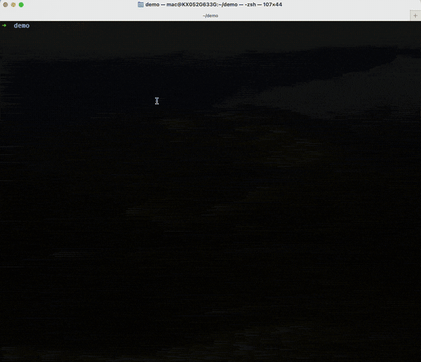
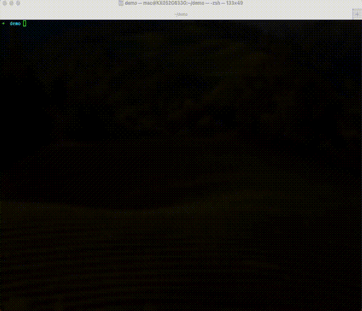
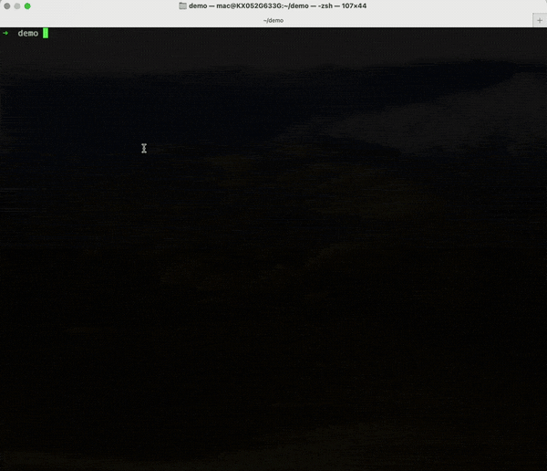

# Clavi Agent

> The key to next-gen intelligent action

[English](./README.md) | 中文

**Clavi Agent** 是一个持续演进中的 Agent 项目。它起步于早期的 mini-agent 探索，如今已经形成自己的产品路线，并与更广泛的 mini-agent 生态并肩前行。项目保留了轻量、专业的运行时基础，同时补强了长期记忆、本地账号隔离和交付物优先工作流，也不再把文档绑定在单一模型厂商上。

该项目具备一系列为稳健、智能的 Agent 开发而设计的特性：

*   ✅ **完整的 Agent 执行循环**：一个完整可靠的执行框架，配备了文件系统和 Shell 操作的基础工具集。
*   ✅ **持久化记忆**：通过内置的 **Session Note Tool**，Agent 能够在多个会话中保留关键信息。
*   ✅ **智能上下文管理**：自动对会话历史进行摘要，可处理长达可配置 Token 上限的上下文，从而支持无限长的任务。
*   ✅ **集成 Claude Skills**：内置多种专业技能，涵盖文档处理、设计、测试和开发等领域。
*   ✅ **集成 MCP 工具**：原生支持 MCP 协议，可轻松接入知识图谱、网页搜索等工具。
*   ✅ **全面的日志记录**：为每个请求、响应和工具执行提供详细日志，便于调试。
*   ✅ **动态 Agent Studio**：通过内置 Marketplace 可视化配置、保存并部署专用 Agent。
*   ✅ **简洁明了的设计**：美观的命令行界面和易于理解的代码库，使其成为构建高级 Agent 的良好起点。

## 目录

- [Clavi Agent](#clavi-agent)
  - [目录](#目录)
  - [快速开始](#快速开始)
    - [1. 准备模型接入信息](#1-准备模型接入信息)
    - [2. 选择使用模式](#2-选择使用模式)
      - [🚀 快速上手模式（推荐新手）](#-快速上手模式推荐新手)
      - [🔧 开发模式](#-开发模式)
    - [记忆能力灰度开关](#记忆能力灰度开关)
  - [本地账号体系](#本地账号体系)
    - [Root 初始化](#root-初始化)
    - [升级历史数据](#升级历史数据)
  - [使用示例](#使用示例)
    - [任务执行](#任务执行)
    - [使用 Claude Skill（例如：PDF 生成）](#使用-claude-skill例如pdf-生成)
    - [网页搜索与摘要（MCP 工具）](#网页搜索与摘要mcp-工具)
  - [交付物优先工作流](#交付物优先工作流)
    - [上传与附件如何工作](#上传与附件如何工作)
    - [上传限制与安全规则](#上传限制与安全规则)
    - [示例流程](#示例流程)
  - [测试](#测试)
    - [快速运行](#快速运行)
    - [测试覆盖范围](#测试覆盖范围)
  - [常见问题](#常见问题)
    - [SSL 证书错误](#ssl-证书错误)
    - [模块未找到错误](#模块未找到错误)
  - [相关文档](#相关文档)
  - [贡献](#贡献)
  - [许可证](#许可证)
  - [参考资源](#参考资源)

## 快速开始

### 1. 准备模型接入信息

Clavi Agent 的文档不再绑定单一模型厂商。首次运行前，请先从你准备接入的模型服务中准备好以下三项信息：

- API Key
- 对应的 API Base URL
- 需要调用的模型名

常见选择包括 OpenAI 兼容接口和 Anthropic 兼容接口。只要你的服务端点与当前配置路径匹配，Clavi Agent 就可以接入你现有的模型服务。

**建议准备步骤：**
1. 在你的模型服务控制台创建或复制 API Key。
2. 确认该服务要求使用的 Base URL。
3. 选定你希望 Clavi Agent 调用的模型名。
4. 把这三个值准备好，稍后写入 `config.yaml`。

### 2. 选择使用模式

**前置要求：安装 uv**

两种使用模式都需要 uv。如果您尚未安装：

```bash
# macOS/Linux/WSL
curl -LsSf https://astral.sh/uv/install.sh | sh

# Windows (PowerShell)
python -m pip install --user pipx
python -m pipx ensurepath
# 安装后需要重启 PowerShell

# 安装完成后，重启终端或运行：
source ~/.bashrc  # 或 ~/.zshrc (macOS/Linux)
```

我们提供两种使用模式。你可以根据自己是想快速体验，还是直接进入代码开发来选择。

#### 🚀 快速上手模式（推荐新手）

此模式适合希望快速体验 Clavi Agent，而无需搭建可编辑开发环境的用户。

**安装步骤：**

```bash
# 直接从当前仓库安装
uv tool install git+https://gitee.com/bnsp/ClaviAgent.git
```

**配置步骤：**

在 `~/.clavi-agent/config/config.yaml` 创建运行时配置文件，然后填入你的模型接入信息：

```yaml
api_key: "YOUR_API_KEY_HERE"
api_base: "https://your-llm-endpoint/v1"
model: "your-model-name"
```

如果你还需要自动补齐 `node`、`npm`、`clawhub` 等运行时依赖，可执行：

```bash
clavi-agent-setup-runtime --config ~/.clavi-agent/config/config.yaml
```

> 💡 **提示**：CLI 与包名仍然保持 `clavi-agent`，而项目本身会继续与 mini-agent 生态并肩演进。

**开始使用：**

```bash
clavi-agent                                    # 使用当前目录作为工作空间
clavi-agent --workspace /path/to/your/project  # 指定工作空间目录
clavi-agent --version                          # 查看版本信息

# 管理命令
uv tool upgrade clavi-agent                    # 升级到最新版本
uv tool uninstall clavi-agent                  # 卸载工具（如需要）
uv tool list                                   # 查看所有已安装的工具
```

#### 🔧 开发模式

此模式适合需要修改代码、添加功能或进行调试的开发者。

**安装与配置步骤：**

```bash
# 1. 克隆仓库
git clone https://gitee.com/bnsp/ClaviAgent.git ClaviAgent
cd ClaviAgent

# 2. 安装 uv（如果尚未安装）
# macOS/Linux:
curl -LsSf https://astral.sh/uv/install.sh | sh
# Windows (PowerShell):
irm https://astral.sh/uv/install.ps1 | iex
# 安装后需要重启终端

# 3. 同步依赖
uv sync

# 替代方案：手动安装依赖（如果不使用 uv）
# pip install -r requirements.txt
# 或者安装必需的包：
# pip install tiktoken pyyaml httpx pydantic requests prompt-toolkit mcp

# 4. 初始化 Claude Skills（可选）
git submodule update --init --recursive

# 5. 复制配置模板
```

**macOS/Linux:**
```bash
cp clavi_agent/config/config-example.yaml clavi_agent/config/config.yaml
```

**Windows:**
```powershell
Copy-Item clavi_agent\config\config-example.yaml clavi_agent\config\config.yaml

# 6. 编辑配置文件
vim clavi_agent/config/config.yaml  # 或使用您偏好的编辑器
```

**首次运行前安装运行时依赖：**
```bash
uv run clavi-agent-setup-runtime --config clavi_agent/config/config.yaml
```

填入你的 API 信息和模型端点：

```yaml
api_key: "YOUR_API_KEY_HERE"
api_base: "https://your-llm-endpoint/v1"
model: "your-model-name"
max_steps: 100
workspace_dir: "./workspace"
```

> 📖 完整的配置指南，请参阅 [config-example.yaml](clavi_agent/config/config-example.yaml)

### 记忆能力灰度开关

长期记忆能力可以在不影响基础 session / agent API 的前提下独立灰度：

```yaml
feature_flags:
  enable_compact_prompt_memory: true
  enable_session_retrieval: true
  enable_learned_workflow_generation: true
  enable_external_memory_providers: true

memory_provider:
  provider: "local"
```

- `enable_compact_prompt_memory`：控制 `User Profile Summary`、`Stable Working Preferences`、工作区本地 `Relevant Agent Memory` 等提示词注入。
- `enable_session_retrieval`：控制 `/api/session-history`、`search_session_history` 工具，以及 `retrieved_context` 提示词注入。
- `enable_learned_workflow_generation`：控制是否从成功 run 中自动生成 learned workflow 候选。
- `enable_external_memory_providers`：控制是否允许 MCP memory adapter 之类的非本地 provider。若该开关关闭且 `provider: "mcp"`，系统会自动回退到本地 SQLite provider。

兼容性规则：

- 关闭这些开关时，现有 session / agent 基础 API 仍可继续使用，只有记忆相关能力会被单独门控。
- 现有 `.agent_memory.json` 会继续作为工作区本地 `agent_memory` 存储存在，统一使用 UTF-8 读写，不会自动迁移到用户级长期记忆。
- 当浏览器认证或显式 `account_id` 不可用时，运行时会回退到内置 `root` 账号，保证本地记忆与检索仍有稳定身份。

**运行方式：**

选择您偏好的方式运行：

```bash
# 方式 1：作为模块直接运行（适合调试）
uv run python -m clavi_agent.cli

# 方式 2：以可编辑模式安装（推荐）
uv tool install -e .
# 安装后，您可以在任何路径下运行，且代码更改会立即生效
clavi-agent
clavi-agent --workspace /path/to/your/project
```

**Web UI / Agent Studio：**

```bash
# 跨平台入口
uv run clavi-agent-server

# 仓库根目录下的便捷脚本
bash start-server.sh   # macOS/Linux
./start-server.ps1     # PowerShell
start-server.cmd       # Windows CMD
```

然后打开 [http://127.0.0.1:8000](http://127.0.0.1:8000)。

> 📖 更多开发指引，请参阅 [开发指南](docs/DEVELOPMENT_GUIDE_CN.md)

> 📖 更多生产部署指引，请参阅 [生产指南](docs/PRODUCTION_GUIDE_CN.md)

### Agent Studio 模板策略

Marketplace 里的 Agent 表单现在把“身份提示词层”和“全局调度策略层”拆开展示：

- `System Prompt` 继续描述 Agent 的身份、风格和业务职责。
- `Delegation Policy` 负责定义主 / 子 agent 的协作边界，例如 `hybrid`、`prefer_delegate`、`supervisor_only`，以及写操作、Shell、有状态 MCP 是否必须委派。
- `LLM Routing` 允许为 planner / worker 分别设置模型覆盖；留空时会继承当前账号的默认模型配置。

系统默认模板在 UI 中以只读方式展示，用来说明当前采用的 supervisor 策略；自建模板则可以独立编辑这些策略，而不需要把整段 delegation prompt 手工粘贴回 `System Prompt`。

## 本地账号体系

Clavi Agent `V1` 现已内置本地账号体系，用于 Web UI 和受保护接口：

- 浏览器管理接口统一使用基于 Cookie 的登录会话。
- 启动时会自动补齐内置 `root` 账号。
- 默认关闭公开注册；新增账号需要由 `root` 在管理入口创建。
- 旧版单机数据可以先迁移到 `root` 名下，而不必立即搬迁历史工作区目录。

### Root 初始化

服务启动时会根据认证配置初始化 `root`：

```yaml
auth:
  auto_seed_root: true
  root_username: "root"
  root_display_name: "Root"
  root_password: "ChangeMe123!"
  web_session_ttl_hours: 12
```

也可以不把密码写入配置文件，而是通过 `CLAVI_AGENT_ROOT_PASSWORD`（或 `root_password_env` 指定的环境变量）提供。若两者都未配置，Clavi Agent 会生成一次性临时密码，并在启动日志中打印出来。

### 升级历史数据

如果您是从旧版单机工作区升级，请先执行内置迁移命令，再开放多人登录：

```bash
uv run clavi-agent-migrate-root-data --config clavi_agent/config/config.yaml
```

该命令会：

- 先备份 `session_db` 与 `agent_db`
- 按需创建 `root` 账号
- 将历史记录回填到 `root`
- 输出逐表校验报告，包含总数、已回填数量和仍为空的归属数量

## 使用示例

这里有几个 Clavi Agent 能力的演示。

### 任务执行

*在这个演示中，我们要求 Agent 创建一个简洁美观的网页并在浏览器中显示它，以此展示基础的工具使用循环。*



### 使用 Claude Skill（例如：PDF 生成）

*这里，Agent 利用 Claude Skill 根据用户请求创建专业文档（如 PDF 或 DOCX），展示了其强大的高级能力。*



### 网页搜索与摘要（MCP 工具）

*此演示展示了 Agent 如何使用其网页搜索工具在线查找最新信息，并为用户进行总结。*



## 交付物优先工作流

Clavi Agent 的 Web UI 现在支持“交付物优先”的工作方式：

1. 先把一个或多个源文件上传到当前会话。
2. 在下一条消息里把这些文件作为附件发送给 Agent。
3. 让 Agent 先检查原文件，再生成修订副本或导出新的交付文件。
4. 在运行详情面板里直接预览、打开或下载最终交付物和相关产物。

### 上传与附件如何工作

- 上传文件会落在当前会话工作区下的 `.clavi_agent/uploads/<session_id>/<upload_id>/<safe_name>`，现有文件工具可以直接读取和修订这些文件。
- 浏览器会先调用上传接口，再在下一条聊天请求里发送 `attachment_ids`，这样文件传输和 SSE 聊天流保持分离。
- 修订后的文件和新生成的报告会被提升为 run deliverable，运行详情会突出展示主交付结果，而不只是显示原始路径。

### 上传限制与安全规则

- 单个文件上传大小上限为 `25 MB`。
- 支持的文件类型包括 `Markdown`、纯文本、`JSON`、`CSV` / `TSV`、`HTML`、`XML`、`YAML`、图片（`PNG`、`JPG`、`GIF`、`SVG`、`WEBP`）、`PDF`，以及 Office 文档（`DOC`、`DOCX`、`PPT`、`PPTX`、`XLS`、`XLSX`、`RTF`）。
- `EXE`、`DLL`、`JS`、`PY`、`SH`、`BAT`、`PS1` 等可执行或脚本类文件会被阻止上传。
- 默认采用 copy-on-write 修订策略。除非用户明确要求覆盖原文件，否则 Agent 应在同一上传目录中生成修订副本。
- 如果工具的目标直接指向上传原件，Clavi Agent 会默认把它提升为更高风险的审批请求；只有模板里为该工具配置了显式自动批准策略时才会跳过审批。

### 示例流程

- 上传 `draft.md`，然后要求：`请优化这份草稿的结构与措辞，并保存一个修订副本。`
- 上传 `review.docx`，然后要求：`请审阅这份文档，保留修订后的 DOCX，并额外导出一份干净的 PDF 交付稿。`
- 直接提问：`请为这个仓库生成一份周报，并把最终结果输出为 Markdown 或 DOCX 文件。`

在已完成运行的详情视图里，上传文件、修订文件和最终交付物都会在支持时提供“预览 / 打开 / 下载”入口。

## 测试

项目包含了覆盖单元测试、功能测试和集成测试的全面测试用例。

### 快速运行

```bash
# 运行所有测试
pytest tests/ -v

# 仅运行核心功能测试
pytest tests/test_agent.py tests/test_note_tool.py -v
```

### 测试覆盖范围

- ✅ **单元测试** - 工具类、LLM 客户端
- ✅ **功能测试** - Session Note Tool、MCP 加载
- ✅ **集成测试** - Agent 端到端执行
- ✅ **外部服务** - Git MCP 服务器加载
- ✅ **账号体系** - 登录登出、会话过期、`root` 迁移、跨账号权限隔离、`webhook` 账号归属

## 常见问题

### SSL 证书错误

如果遇到 `[SSL: CERTIFICATE_VERIFY_FAILED]` 错误：

**测试环境快速修复**（修改 `clavi_agent/llm.py`）：
```python
# 第 50 行：给 AsyncClient 添加 verify=False
async with httpx.AsyncClient(timeout=120.0, verify=False) as client:
```

**生产环境解决方案**：
```bash
# 更新证书
pip install --upgrade certifi

# 或配置系统代理/证书
```

### 模块未找到错误

确保从项目目录运行：
```bash
cd ClaviAgent
python -m clavi_agent.cli
```

## 相关文档

- [开发指南](docs/DEVELOPMENT_GUIDE_CN.md) - 详细的开发和配置指引
- [生产环境指南](docs/PRODUCTION_GUIDE_CN.md) - 生产部署最佳实践

## 贡献

我们欢迎并鼓励您提交 Issue 和 Pull Request！

- [贡献指南](CONTRIBUTING.md) - 如何为项目做贡献
- [行为准则](CODE_OF_CONDUCT.md) - 社区行为准则

## 许可证

本项目采用 [MIT 许可证](LICENSE) 授权。

## 参考资源

- ClaviAgent 仓库: https://gitee.com/bnsp/ClaviAgent.git
- Anthropic API: https://docs.anthropic.com/claude/reference
- Claude Skills: https://github.com/anthropics/skills
- MCP Servers: https://github.com/modelcontextprotocol/servers

---

**⭐ 如果这个项目对您有帮助，请给它一个 Star！**
